ToolJet是一个**开源低代码框架**，可以用最少的工程工作量快速构建和部署内部工具。ToolJet的拖放式前端构建器允许您在几分钟内构建复杂的响应式前端。您还可以连接到数据源，如数据库（PostgreSQL、MongoDB、Elasticsearch等）、API端点（ToolJet支持导入OpenAPI规范和OAuth2授权）、SaaS工具（Stripe、Slack、Google Sheets、Airtable、Notion等）和对象存储服务（S3、GCS、Minio等），以获取和写入数据。

[](https://github.com/ToolJet/ToolJet)

## 快速试用
测试账户:test@qq.com<br>
测试密码:123456<br>
[点击测试ToolJet_cn](https://tooljet.mousheng.top/)<br>

### **因本人精力和能力有限，兼容性暂未作测试，不建议将本软件用作生产环境**

<p align="center">
    

</p>

# 主要修改

- **时间线组件** 添加基于Ant Design的时间线组件，支持图标渲染、时间轴左右、交替显示，时间轴翻转，未完成节点动态显示等。
<p align="center">
    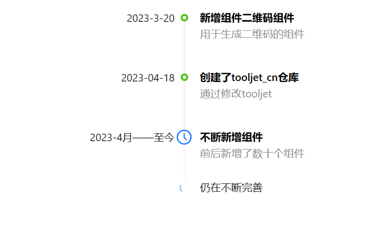

- **框架组件** 添加添加框架组件方便生成单页面程序，支持自定义菜单渲染，支持菜单收缩，支持代码控制菜单选择，支持自定义眉页
<p align="center">
    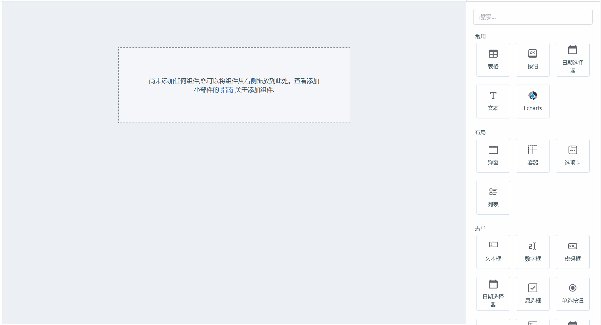

- **评论组件** 添加评论组件，支持手动设置图片头像或文字头像，支持自定义提及(@为人名提及指令)，支持自定义头像背景色循环列表，支持点击评论、提交评论、文本改变等事件动作
<p align="center">
    

- **多类型日期选择框** 支持多种日期类型输入：时间、日期、周、月、季、年，以及时间范围输入
<p align="center">
    

- **自动补全组件** 重置自动补全组件，支持全拼、首拼搜索，支持搜索事件、选择事件、获取焦点事件回调，支持三种样式切换
<p align="center">
    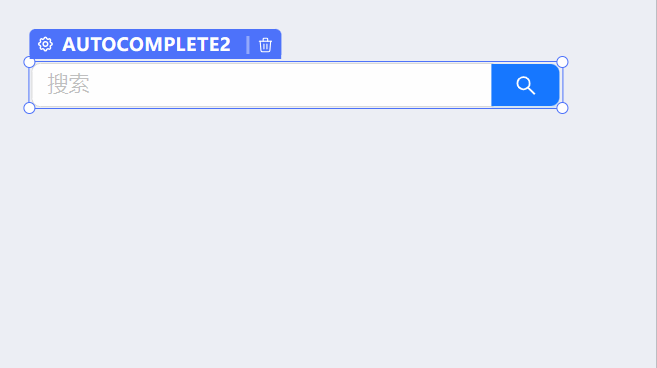
</p>

- **相册组件** 支持设置封面图，支持多图片预览，全屏预览时支持翻转、旋转、放大、缩小，支持载入失败设置占位图
<p align="center">
    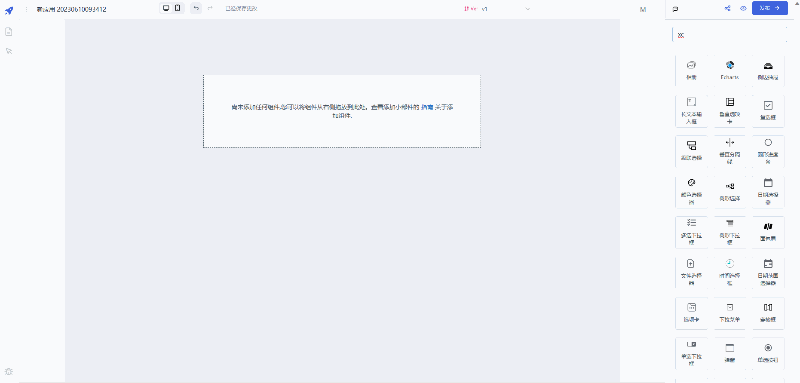
</p>

- **气泡确认框** 支持设置标题、图标、所有文本的自定义，支持设置弹出方向，支持异步关闭
<p align="center">
    
</p>

- **请求头批量导入** 批量添加请求头功能
<p align="center">
    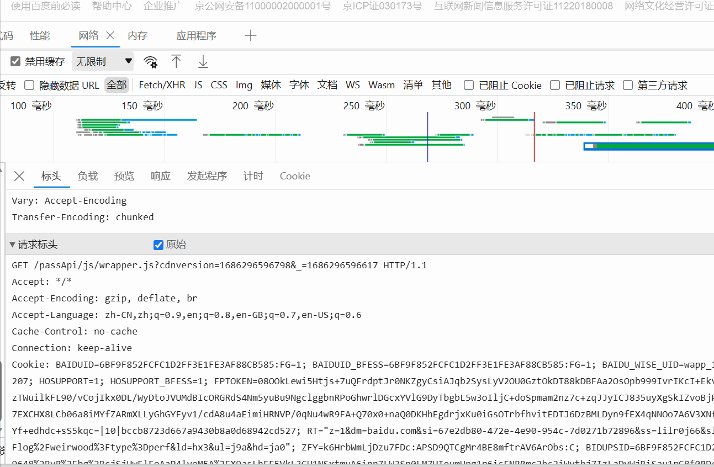
</p>

- **优化代码提示** 优化JS代码编辑器中，添加对console.log、window.localStorage、lodash、moment等常用函数的代码提示
<p align="center">
    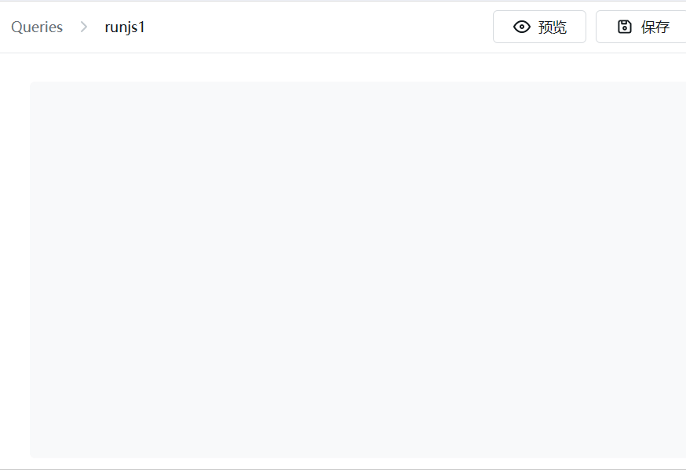
</p>

- **下拉菜单按钮** 支持载入状态显示，支持设置按钮图标，支持下拉菜单图标、高亮、禁用，支持下拉菜单激活方式切换(鼠标经过激活有失效问题)，支持按钮样式设置，支持弹出方向设置
<p align="center">
    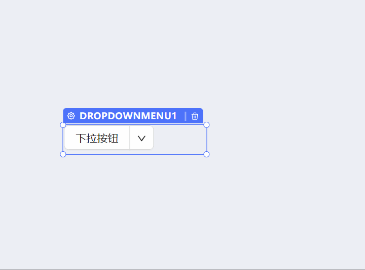
</p>

- **面包屑组件** 添加面包屑组件，支持点击响应，可根据点击值，使用js代码完成想要的动作
<p align="center">
    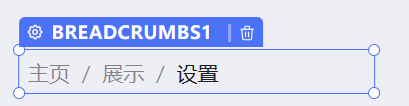
</p>

- **树形控件** 支持高亮显示搜索匹配项，显示或隐藏搜索框，支持代码控制默认展开项，默认选中项，支持单、多选切换，支持拼音搜索，支持渲染图标，支持设置无法勾选或无法选中的子项
<p align="center">
    
</p>

- **树形选择框** 支持代码控制默认选中，支持单、多选切换，支持拼音搜索标签和值，支持显示结构线，支持隐藏边框，支持设置最大下拉高度
<p align="center">
    
</p>


- **描述列表** 支持编辑按钮事件回调，支持水平和垂直布局切换，支持设置每行列数，支持解析'\n'换行符
<p align="center">
    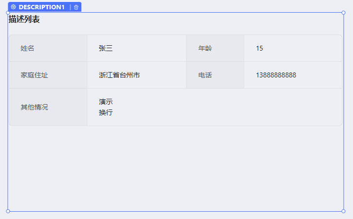
</p>


- **头像组件** 支持外部图片、Ant图标、文字显示(渲染顺序图片>文字>图标),允许切换方形、圆形外观，方形外观下支持显示角标，支持回调点击事件
<p align="center">
    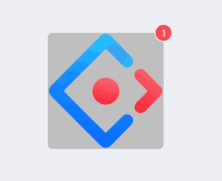
</p>


- **时间选择框** 支持设置默认时间，支持设置时间格式，支持设置时/分/秒间隔步长，支持切换时间范围选择切换，自动排序起始时间
<p align="center">
    
</p>


- **穿梭框** 支持代码选中，支持搜索，支持单双向模式切换，支持分页和设置分页大小
<p align="center">
    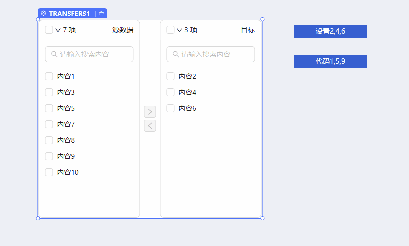
</p>


- **侧边抽屉** 支持上下左右四个方向弹出，支持两种弹出宽度，支持套娃弹出，支持代码控制弹出、关闭
<p align="center">
    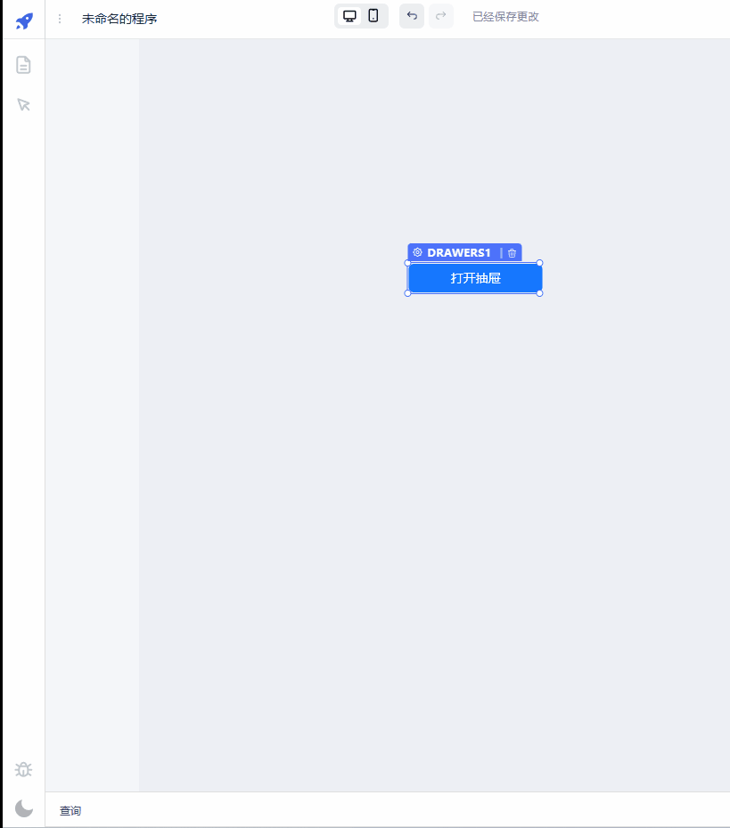
</p>


- **单选按钮组** 允许根据列表生成单选按钮组，支持设置选中值，支持单选类型和按钮类型切换
<p align="center">
    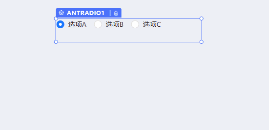
</p>


- **单选按钮组** 允许根据列表生成单选按钮组，支持设置选中值，支持单选类型和按钮类型切换
<p align="center">
    
</p>


- **提及输入框** 允许设置自定义提及快捷键与提及内容
<p align="center">
    
</p>


- **级联选择框** 支持设置默认值，支持设置点击展开或移入展开，支持自定义映射key，原生支持全拼、首拼搜索，允许多选，允许设置四个方位弹出
<p align="center">
    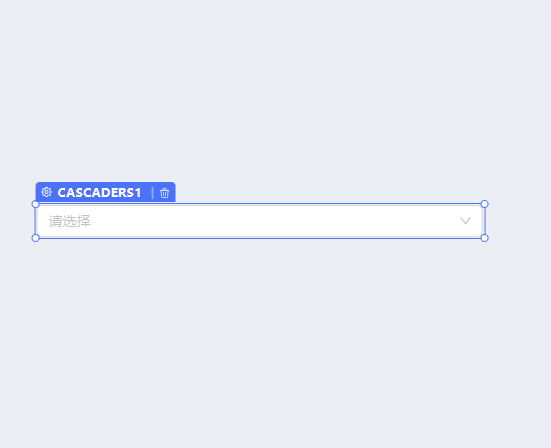
</p>


- **导航菜单** 支持图标、二级菜单渲染，支持动态设置隐藏、禁用，支持默认选中菜单、默认展开菜单，支持垂直收缩布局，支持三种菜单模式，配合抽屉组件，可实现弹出菜单效果
<p align="center">
    
</p>

- **列表菜单** 支持显示主副标题、序号、角标，支持单独禁用选项，支持水平及垂直布局切换，支持代码选择
<p align="center">
    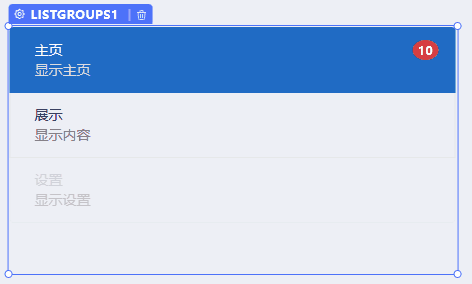
</p>

- **单选按钮组组件** 添加只能单选的按钮组组件，支持代码设置选择
<p align="center">
    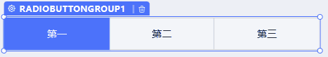
</p>

- **走马灯组件** 添加走马灯组件，支持设置过渡方式、切换间隔时间、全部图片填充方式，支持指定页面指定填充方式设置
<p align="center">
    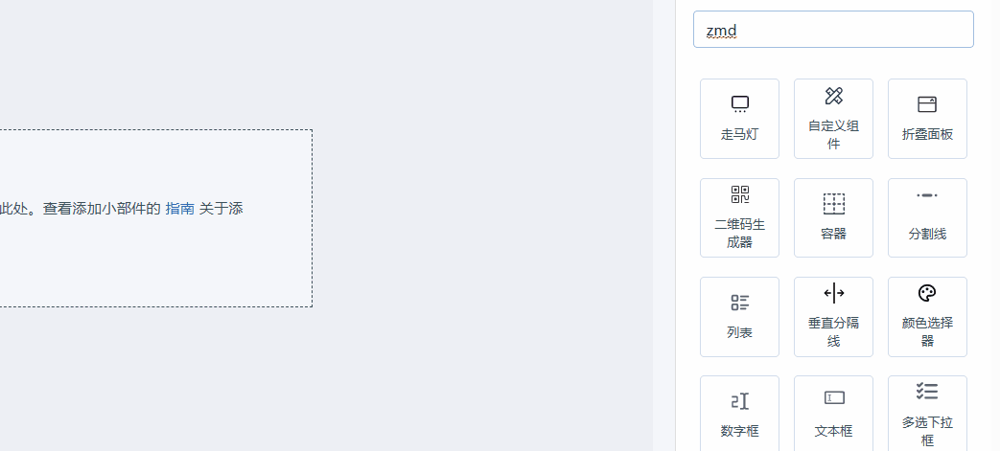
</p>

- **角标文本组件** 添加带角标的文本组件，支持分开设置文本和角标的大小、背景颜色，支持相应点击动作，支持代码设置文本和角标内容等
<p align="center">
    
</p>

- **折叠面板组件** 添加折叠面板组件
<p align="center">
    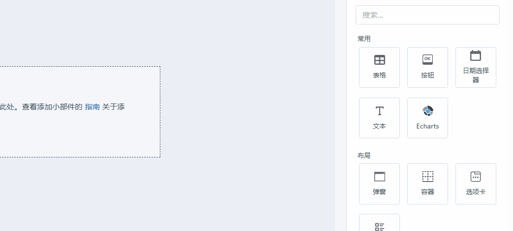
</p>

- **进度条组件** 添加进度条组件
<p align="center">
    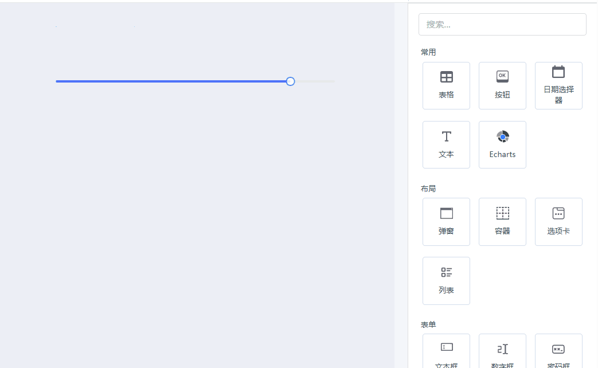
</p>

- **添加角标** 为按钮控件添加角标显示
<p align="center">
    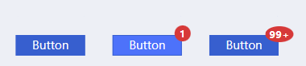
</p>

- **添加组件脚手架** 一键添加新组件的脚手架
```
# 全局安装脚手架
npm i tooljet-cn-cli -g
# 添加组件
tooljet-cn-cli add
```
<p align="center">
    
</p>

- **垂直选项卡:** 垂直布局的选项卡
<p align="center">
    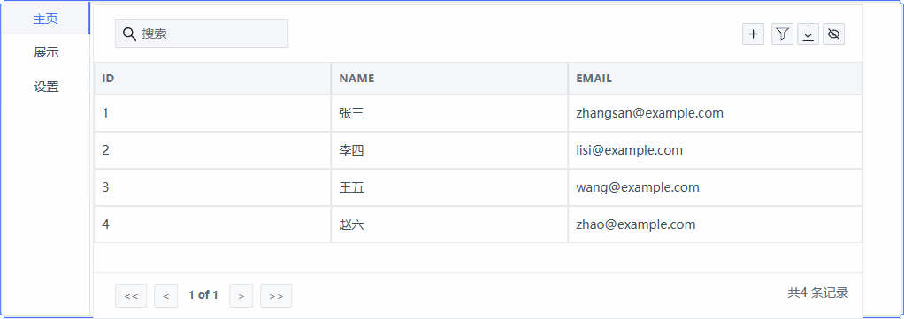
</p>

- **拼音检索:** 单选框、多选框添加全拼、首拼搜索的支持
<p align="center">
    
</p>

- **组件面板搜索描述:** 组件面板支持描述的搜索，支持显示名首、全拼搜索，支持描述首拼搜索
<p align="center">
    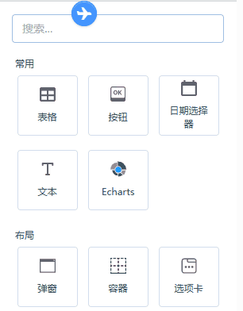
</p>

- **添加签字组件:** 添加签字组件，支持裁剪、自定义钢笔颜色、单步撤销
<p align="center">
    
</p>

- **添加音频播放器组件:** 添加音频播放器组件,支持设置自动播放(因Google浏览器限制，浏览器需打开允许媒体自动播放选项)、循环以及代码加载新的音频源、代码控制播放状态
- **添加视频播放器组件:** 添加视频播放器组件，支持海报显示、自动播放（因Google浏览器限制，自动播放收到限制，可设置自动播放且默认静音）、循环播放，可代码控制播放状态、全屏、加载视频，以及播放、暂停、结束时事件响应
<p align="center">
    
</p>

- **添加二维码生成组件:** 添加二维码生成组件，支持渲染类型、纠错等级、填充颜色等属性的设置
- **添加Echarts组件:** 添加Echarts组件，支持3D图表，支持响应鼠标点击事件

<p align="center">
    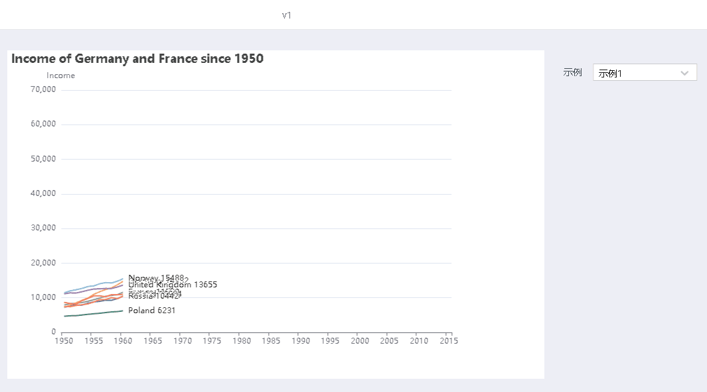
</p>

- **添加高德地图组件:** 复刻原Google地图组件所有功能，并添加比例尺、定位当前位置、右键删除标记事件等功能，(地名搜索补全没反应的话，是因为免费API调用上限只有100次/天，请更换自己的api即可正常使用)
<p align="center">
    
</p>

- **导航栏隐藏:** 当所有页面都为隐藏时，导航栏自动隐藏


- **汉化:** 对绝大部分界面、组件做了深度汉化
- **符合国内习惯:** 修改npm国内源、日期格式改为YYYY/mm/dd

## 一键私有部署

请确保安装了Docker，如果没有请自行百度一下如何安装docker,在linux下或window的WSL模式下输入以下代码

```bash
# 配置环境变量
wget -O autoConfigure.sh https://yun.mousheng.top/tooljet/autoConfigure.sh && chmod 755 autoConfigure.sh && bash autoConfigure.sh
# 如需后台运行，可运行以下命令
cd ~/tooljet_cn && docker-compose up -d
```
## 一键二次开发
使用Docker镜像二次开发，可避免本机软件环境造成启动或者安装失败，复制以下代码即可快速开始
```bash
#克隆代码到本地，切换到代码根目录，运行develop_tooljet_in_ubuntu_by_mou.sh即可
git clone https://github.com/mousheng/tooljet_cn.git && cd tooljet_cn
./develop_tooljet_in_ubuntu_by_mou.sh
```


## 文档
[HuangWanddy翻译的中文文档](https://tdoc.xhrjy.cn/docs/contributing-guide/setup/docker)<br>
[官方英文文档](https://docs.tooljet.com)<br>

<hr>

## 所有功能

- **可视化应用程序生成器:** 40多个内置组件，如表格、图表、列表、窗体、进度条等
- **ToolJet 数据库:** 内置无代码数据库.
- **多页面:** 生成一个包含任意页面的应用程序
- **多人编辑:** 多个用户可以同时使用应用程序生成器.
- **40+ 数据源:** 可连接到40+外部数据库、云存储和api.
- **桌面端 & 移动端:** 可以自定义布局宽度以支持不同的屏幕.
- **私有部署:** (支持 Docker, Kubernetes, Heroku, AWS EC2, Google Cloud Run, 等等).
- **合作:** 在画布上的任何位置添加评论，并标记您的团队成员.
- **使用插件进行扩展:** 使用 [commandline tool](https://www.npmjs.com/package/@tooljet/cli) 轻松生成新的扩展.
- **版本控制:** 每个应用程序都有不同的版本，并有适当的发布周期.
- **运行 JS & Python 代码:** 可运行自定义的JS及Python代码.
- **细粒度访问控制** 组级别和应用程序级别的细粒度访问控制.
- **低代码:** 几乎在生成器中的任何位置编写js代码例如，文本的颜色属性可以设置为`status === 'success' ? 'green' : 'red'`
- **零代码查询编辑器:** 用于所有支持的数据源.
- **连接和转换数据:** 可使用javascript/python代码转换查询结果.
- **安全:** 所有凭据都使用安全加密 `aes-256-gcm`.
- **不存储数据:** tooljet仅充当代理，不存储任何数据.
- **SSO:** 支持多个SSO提供程序

<hr>

#############################以下均为英文社区###############################
## 社区支持
有关使用tooljet的一般帮助，请参阅官方网站 [文档](https://docs.tooljet.com/docs/). 要获得更多帮助，您可以使用其中一个渠道提问:

- [Slack](https://tooljet.com/slack) - 与社区和团队的讨论
- [GitHub](https://github.com/ToolJet/ToolJet/issues) - 用于错误报告和功能请求.
- [Twitter](https://twitter.com/ToolJet) - 轻松获取产品更新.

## 路线图
查看我们的[roadmap](https://github.com/ToolJet/ToolJet/projects/2) 了解发布的最新功能和即将推出的功能


## 贡献者
<a href="https://github.com/tooljet/tooljet/graphs/contributors">
  
  
</a>

## 许可证
ToolJet © 2022, ToolJet Solutions Inc - Released under the GNU Affero General Public License v3.0.
